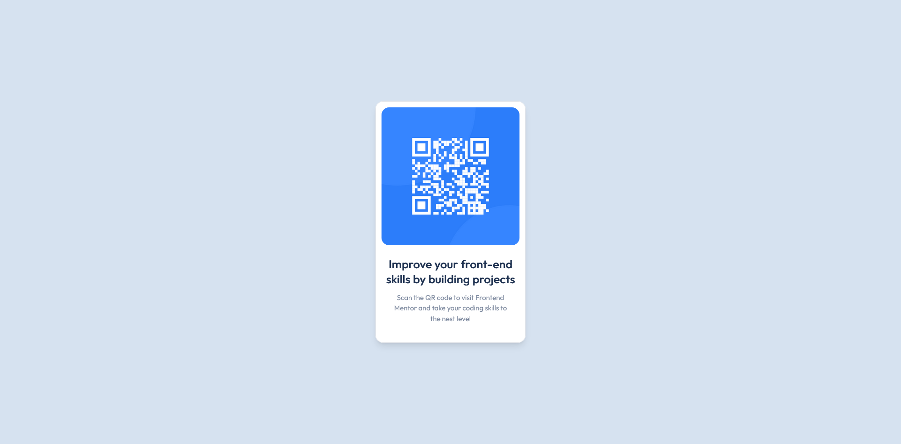

# Frontend Mentor - QR code component solution

This is a solution to the [QR code component challenge on Frontend Mentor](https://www.frontendmentor.io/challenges/qr-code-component-iux_sIO_H). Frontend Mentor challenges help you improve your coding skills by building realistic projects. 

## Table of contents

- [Overview](#overview)
  - [Screenshot](#screenshot)
  - [Links](#links)
- [My process](#my-process)
  - [Built with](#built-with)
  - [What I learned](#what-i-learned)
  - [Continued development](#continued-development)
  - [Useful resources](#useful-resources)
- [Author](#author)
- [Acknowledgments](#acknowledgments)


## Overview

### Screenshot



### Links

- Solution URL: [Add solution URL here](https://www.frontendmentor.io/solutions/qr-code-component-using-react-and-tailwind-VdHVDKXKCZ)
- Live Site URL: [Add live site URL here](https://frontend-mentor-challenge1-youssefjemmane.vercel.app/)

## My process

### Built with

- [React](https://reactjs.org/) - JS library
- [Tailwind](https://tailwindcss.com/) - For styles

### What I learned

I use Custom css in tailwind it's my first time using it and I really like it.

```json
theme: {
    extend: {
      colors:{
        lightgrey :"hsl(212, 45%, 89%)",
        white: "hsl(0, 0%, 100%)",
        grayishblue: "hsl(220, 15%, 55%)",
        darkblue:"hsl(218, 44%, 22%)",
      },
      fontFamily: {
        'outfit': ['"Outfit"', 'sans-serif'],
      },
      fontSize: {
        p:"15px",
      },
      screens: {
        mobile: "375px",
        desktop: "1440px",
      },
    },
  }
```

### Continued development

I'm still not comfortable with getting the colors from the style-guide.md file and I want to improve my skills in tailwind.

### Useful resources

- [Example resource 1](https://tailwindcss.com/) - The Tailwind documentation helped me a lot to understand how to use custom css.

## Author

- Website - [YoussefJemmane](https://jemmane.vercel.app/)
- Frontend Mentor - [@YoussefJemmane](https://www.frontendmentor.io/profile/YoussefJemmane)

## Acknowledgments

I want to thank Frontend Mentor for this challenge.